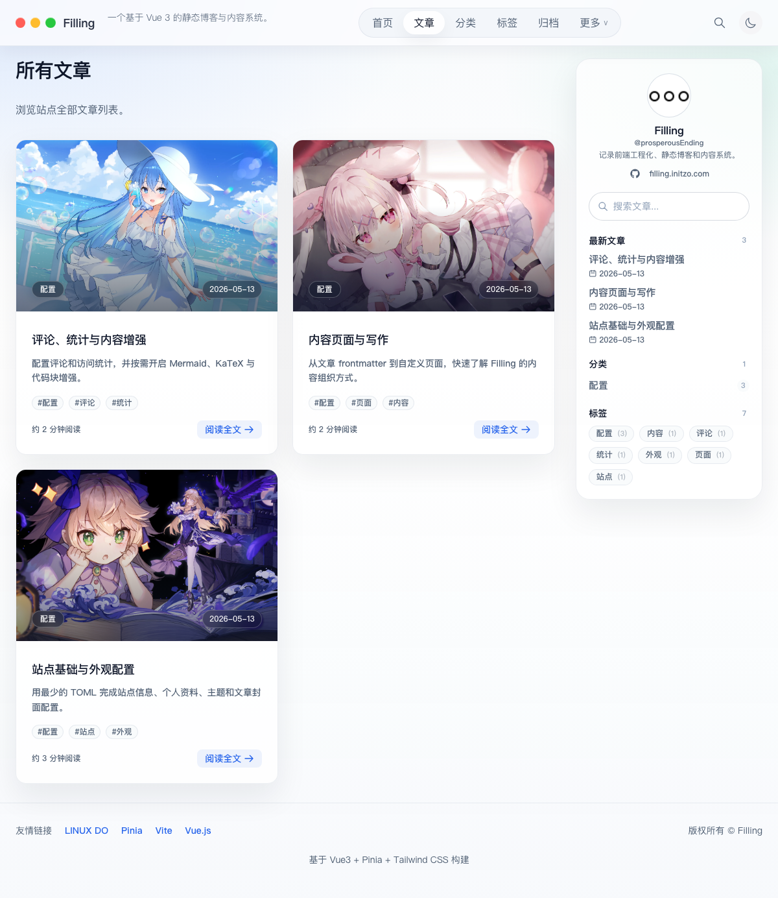
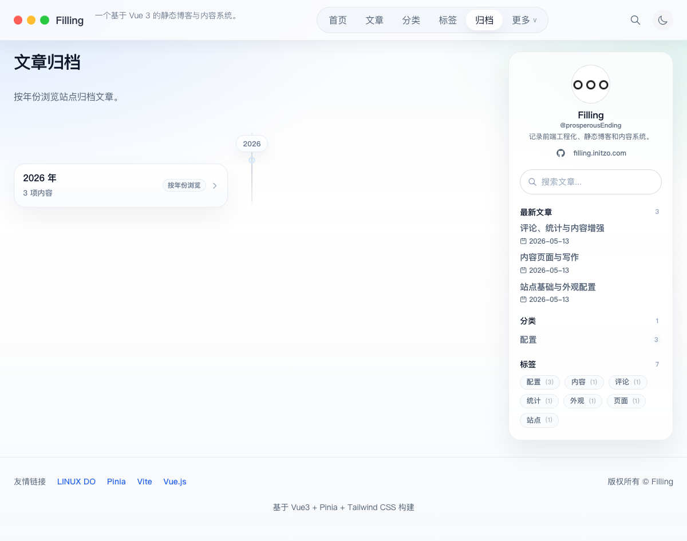
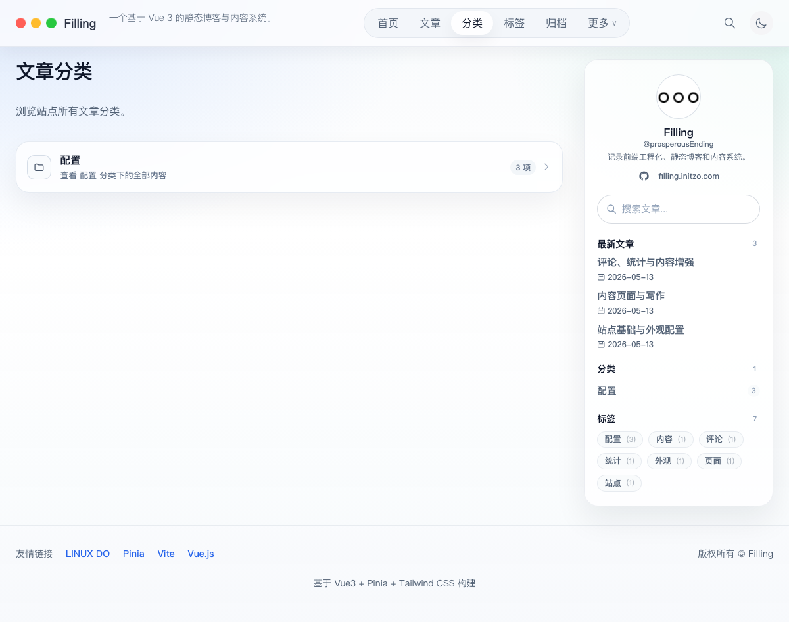
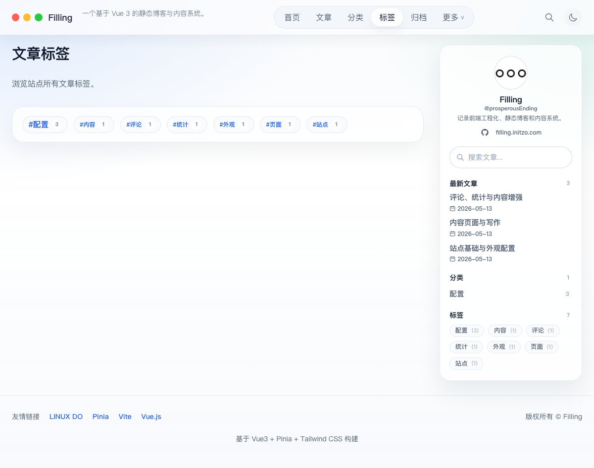
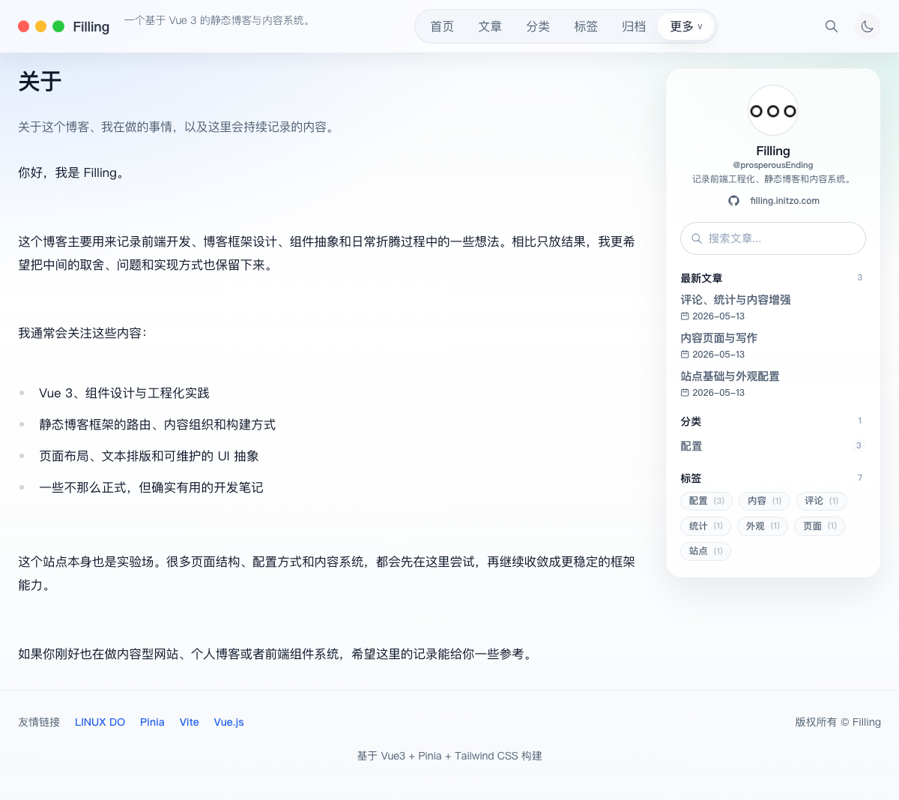
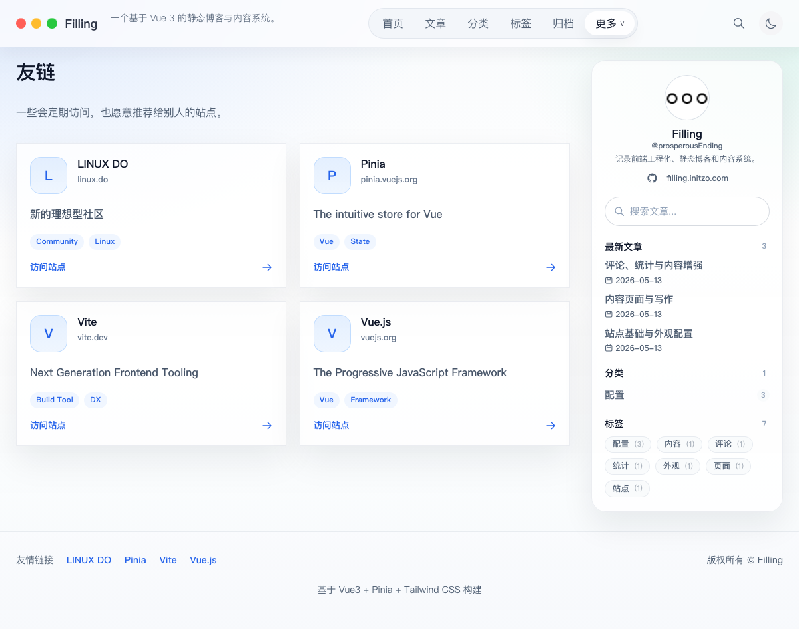
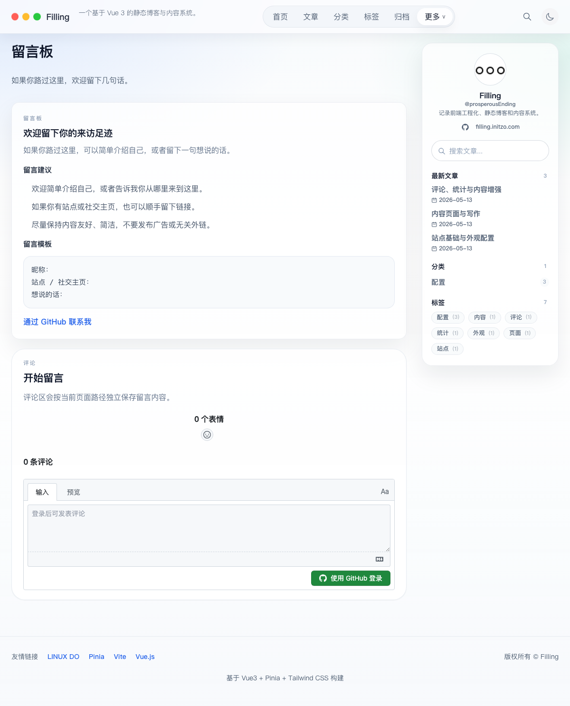

<div align="center">
  <h1>Filling</h1>
  <p>一个由 Markdown 与 TOML 驱动的 Vue 3 静态博客框架。</p>
  <p>
    <a href="https://filling.initzo.com">在线预览</a>
    ·
    <a href="./docs/configuration.md">配置参考</a>
    ·
    <a href="./docs/online-admin-setup.md">线上管理部署</a>
  </p>
</div>

Filling 同时提供可直接部署的博客站点和可复用的前端框架层。文章使用 Markdown 编写，站点行为集中在 TOML 中配置，构建后可以作为纯静态文件部署到 GitHub Pages。

## 界面预览


<table>
  <tr>
    <td width="72%" valign="top">
      <strong>沉浸式文章页</strong><br><br>
      
    </td>
    <td width="28%" valign="top">
      <strong>移动端首页</strong><br><br>
      
    </td>
  </tr>
</table>

### 菜单页面

<table>
  <tr>
    <td width="50%" valign="top">
      <strong>文章</strong><br><br>
      
    </td>
    <td width="50%" valign="top">
      <strong>归档</strong><br><br>
      
    </td>
  </tr>
  <tr>
    <td width="50%" valign="top">
      <strong>分类</strong><br><br>
      
    </td>
    <td width="50%" valign="top">
      <strong>标签</strong><br><br>
      
    </td>
  </tr>
  <tr>
    <td width="50%" valign="top">
      <strong>关于</strong><br><br>
      
    </td>
    <td width="50%" valign="top">
      <strong>友链</strong><br><br>
      
    </td>
  </tr>
  <tr>
    <td colspan="2" valign="top">
      <strong>留言板</strong><br><br>
      
    </td>
  </tr>
</table>

## 核心能力

| 模块 | 能力 |
| --- | --- |
| 内容 | Markdown 文章、独立页面、自定义内容目录、分类、标签、归档与全文搜索 |
| 布局 | 自动导航、响应式侧边栏、移动端菜单，以及 `list`、`card`、`grid`、`timeline` 页面布局 |
| 外观 | 主题预设、亮暗模式、站点背景、统一文章封面图源和详情页沉浸背景 |
| Markdown | Callout、Mermaid、KaTeX、代码高亮、行号、复制按钮和长代码折叠 |
| 互动 | giscus / utterances 评论、友链、留言板、公告、赞助和访问统计 |
| 输出 | 静态路由、SEO 元数据、RSS、Sitemap、404 页面和 GitHub Pages 工作流 |
| 管理 | GitHub 登录的线上配置后台，通过 Cloudflare Worker 安全提交 TOML 配置 |

## 快速开始

准备 Node.js LTS 和 pnpm 10，然后运行：

```bash
git clone https://github.com/ProsperousEnding/Filling.git
cd Filling
pnpm install
pnpm exec playwright install chromium
pnpm dev
```

访问终端中 Vite 输出的本地地址。修改文章或 TOML 配置时，开发服务器会自动更新。

## 配置站点

日常使用集中在以下目录：

```text
blog/
├── config/               # 站点 TOML 配置
│   └── optional/         # 低频或按需启用的功能
└── content/
    ├── articles/         # Markdown 文章
    ├── about.md          # 独立 Markdown 页面
    └── <folder>/         # 可选的自定义内容目录
public/                   # 图片、图标、字体和主题资源
```

配置遵循“只写需要修改的值”，未填写字段由框架默认值补齐。

| 文件 | 用途 |
| --- | --- |
| `site.toml` | 站点信息、首页文章策略、导航、功能开关和页脚 |
| `profile.toml` | 侧边栏资料、头像、网站和社交链接 |
| `theme.toml` | 当前主题及主题资源预设，页面背景由主题统一管理 |
| `cover.toml` | 文章封面图源、列表封面和详情页显示方式 |
| `comment.toml` | giscus 或 utterances 评论服务 |
| `links.toml` | 友情链接页面与链接数据 |
| `optional/*.toml` | 字体、留言板、统计、公告、赞助、Markdown 和代码块增强 |

最小站点配置示例：

```toml
title = "My Blog"
description = "记录我的学习与思考。"
site_url = "https://blog.example.com"

[home_articles]
mode = "latest"
```

文章自动封面由 `blog/config/cover.toml` 统一控制：

```toml
enabled = true
fallback = "seeded"
seeded_style = "mwm-anime"
fixed = false
```

默认会在每次构建发布时打乱 MWM 图片池，并让同一版本的预渲染页面与客户端保持一致。在配置后台打开“固定文章封面”后，框架会按文章从 `source_urls` 中稳定选择图片，使封面跨版本保持不变。可选图源和所有字段说明见 [配置参考](./docs/configuration.md)。修改后可以单独检查配置：

```bash
pnpm build:config
```

## 写一篇文章

在 `blog/content/articles/` 中创建 Markdown 文件：

```markdown
---
title: 示例文章
date: 2026-08-21
description: 用一句话说明文章解决的问题。
category: 前端
tags:
  - Vue
  - Vite
cover_display_mode: page-background
---

从这里开始写正文。
```

常用 frontmatter：

- `sticky`、`featured`、`weight`：调整首页内容优先级。
- `home_hidden`：从首页隐藏，但仍保留文章路由。
- `cover`：为单篇文章指定封面图片。
- `cover_display_mode`：选择 `image`、`header-background` 或 `page-background`。

仓库内也提供了可以直接在站点中阅读的指南：

- [站点基础与外观配置](./blog/content/articles/config-site-and-theme.md)
- [内容页面与写作](./blog/content/articles/config-content-and-pages.md)
- [评论、统计与内容增强](./blog/content/articles/config-comments-and-analytics.md)

## 页面与导航

首页、文章、分类、标签、归档和搜索是内置页面。添加 Markdown 页面时，在 `site.toml` 中注册：

```toml
[[menus.pages]]
key = "about"
title = "关于"
component = "context"
file = "about.md"
```

启用且可见的页面会自动进入桌面和移动端导航。内容目录可以选择 `list`、`card`、`grid` 或 `timeline` 组件，并通过配置控制列数、排序和分页。

## 常用命令

| 命令 | 作用 |
| --- | --- |
| `pnpm dev` | 启动 Vite 开发服务器并启用热更新 |
| `pnpm build:config` | 解析、校验并生成站点配置 |
| `pnpm build:content-index` | 重新生成内容和搜索索引 |
| `pnpm test` | 运行单元测试与组件测试 |
| `pnpm test:e2e` | 在 Chromium 与 WebKit 中验证关键页面与响应式布局 |
| `pnpm test:visual` | 在 Chromium 中核对当前平台的页面截图基线 |
| `pnpm audit:prod` | 检查生产依赖的已知安全漏洞 |
| `pnpm build` | 构建静态站点到 `dist/` |
| `pnpm build:lib` | 构建可复用框架到 `dist-lib/` |
| `pnpm check` | 运行安全审计、全部测试、构建、组件库与 Worker 完整验证 |

## 构建与部署

```bash
pnpm build
```

`dist/` 包含静态 HTML、前端资源、`404.html`、`sitemap.xml`、`robots.txt` 和 RSS。仓库中的 [GitHub Pages 工作流](./.github/workflows/deploy-pages.yml) 会在推送后完成测试、构建和部署。

在仓库 `Settings > Pages` 中将 Source 设为 `GitHub Actions`。自定义部署地址可以通过仓库变量控制：

- `PAGES_SITE_URL`：正式站点地址。
- `PAGES_BASE_PATH`：部署子路径；独立域名通常使用 `/`。

## 线上配置管理

站点包含 `/admin/config` 管理页面和 Cloudflare Worker API。管理员通过 GitHub 登录后，可以在允许范围内编辑 TOML，并将多个配置变更作为一次提交发布到仓库。

Worker 负责验证来源、管理员身份、配置白名单、字段内容和远端提交版本。GitHub App 权限、Cloudflare 环境变量与部署流程见 [线上配置管理部署说明](./docs/online-admin-setup.md)。服务端密钥只能存放在 Cloudflare Secret 中。

## 项目结构

```text
src/
├── framework/            # 组件、视图、路由、内容服务、store 与库入口
└── site/                 # 当前站点装配与管理端
scripts/                  # 配置、内容索引和静态站点生成脚本
worker/                   # 线上配置管理 API
tests/                    # Node 单元测试与 Vue 组件测试
docs/                     # 配置、部署文档与项目截图
```

框架层通过运行时上下文接收内容适配器、配置源和部署 base，不直接依赖当前站点的 `blog/` 目录。作为组件库开发时使用：

```bash
pnpm build:lib
pnpm test:package
```

## License

[MIT](./LICENSE)

相关社区：[LINUX DO](https://linux.do/)
