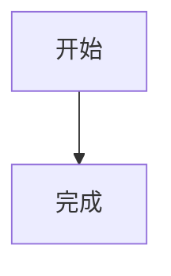

评论属于常用配置，放在 `blog/config/comment.toml`。统计、Markdown 增强和代码块增强属于低频细节配置，放在 `blog/config/optional/`。

## 评论配置

`comment.toml` 控制文章评论区，也会作为留言板评论的默认配置。

常用写法：

```toml
enabled = true
provider = "giscus"
title = "评论"
description = "欢迎通过 GitHub Discussions 留下你的看法。"
not_ready_text = "请先在 GitHub 仓库启用 Discussions，并补全 giscus 分类配置。"

[giscus]
repo = "owner/repo"
repo_id = "R_xxx"
category = "Announcements"
category_id = "DIC_xxx"
mapping = "pathname"
input_position = "bottom"
lang = "zh-CN"
theme = "light"
dark_theme = "dark_dimmed"
```

顶层字段：

- `enabled`：是否启用评论区
- `provider`：评论提供商
- `title`：评论区标题
- `description`：标题下说明
- `not_ready_text`：配置不完整时显示的文案

当前支持：

- `giscus`：基于 GitHub Discussions
- `utterances`：基于 GitHub Issues

## giscus

giscus 必填字段：

- `repo`：仓库名，格式 `owner/repo`
- `repo_id`：仓库 ID
- `category`：Discussion 分类名
- `category_id`：Discussion 分类 ID

常用字段：

- `mapping`：页面映射方式
- `input_position`：输入框位置，可选 `top` 或 `bottom`
- `lang`：评论区语言
- `theme`：亮色主题
- `dark_theme`：暗色主题

`mapping` 可选值：

- `pathname`：按路径映射
- `url`：按完整 URL 映射
- `title`：按标题映射
- `og:title`：按 OG 标题映射
- `specific`：固定映射到指定 `term`

如果 `mapping = "specific"`，还需要配置：

```toml
term = "guestbook"
```

## 留言板独立评论

留言板默认继承 `comment.toml`。如果希望留言板固定到独立 Discussion，在 `optional/guestbook.toml` 里配置：

```toml
[comment]
enabled = true
provider = "giscus"
title = "开始留言"
description = "这里的评论会单独归到留言板。"

[comment.giscus]
mapping = "specific"
term = "guestbook"
```

`repo`、`repo_id`、`category`、`category_id` 不写时会继承 `comment.toml`。

## utterances

使用 utterances 时：

```toml
enabled = true
provider = "utterances"

[utterances]
repo = "owner/repo"
issue_term = "pathname"
label = "comment"
theme = "github-light"
dark_theme = "github-dark"
crossorigin = "anonymous"
```

必填条件：

- `repo`
- `issue_term` 或 `issue_number` 二选一

## 统计配置

`optional/analytics.toml` 控制统计脚本。

启用统计需要同时满足：

- 顶层 `enabled = true`
- 对应 provider 的 `enabled = true`
- provider 必填字段完整

当前支持：

- `umami`
- `plausible`
- `google_analytics`
- `clarity`

Umami 示例：

```toml
enabled = true
respect_dnt = true

[umami]
enabled = true
script_url = "https://cloud.umami.is/script.js"
website_id = "your-website-id"
```

GA4 示例：

```toml
enabled = true

[google_analytics]
enabled = true
measurement_id = "G-XXXXXXXXXX"
```

Clarity 示例：

```toml
enabled = true

[clarity]
enabled = true
project_id = "your-project-id"
```

## Markdown 增强

`optional/markdown.toml` 控制 Markdown 增强。

当前支持：

- GitHub 风格 callout
- Mermaid 图表
- KaTeX 数学公式

callout 示例：

```markdown
> [!NOTE]
> 这是一条提示。
```

Mermaid 示例：

```markdown

```

数学公式示例：

```markdown
行内公式：$E = mc^2$

块级公式：

$$
E = mc^2
$$
```

## 代码块增强

`optional/code_block.toml` 控制代码块展示。

常用能力：

- 显示语言标签
- 显示文件名
- 复制按钮
- 行号
- 长代码折叠
- diff 增删行标记
- 按语言覆盖配置

示例：

````markdown
```js title="main.js"
console.log('hello')
```
````

按语言覆盖示例：

```toml
[languages.bash]
show_line_numbers = false
wrap_long_lines = true

[languages.diff]
mark_diff_lines = true
show_copy_button = false
```

## 可选配置位置

这些文件都在 `blog/config/optional/`：

- `analytics.toml`
- `code_block.toml`
- `markdown.toml`
- `guestbook.toml`

如果用不到，可以保持默认文件不动。需要修改时直接改对应文件，不要在根目录再新建同名配置。
