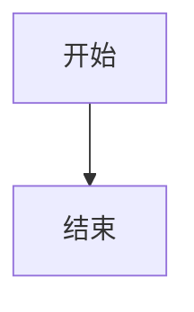

## 文章 frontmatter

常用写法：

```yaml
---
title: 示例文章
date: 2026-05-01
updated: 2026-05-10
description: 一段摘要
category: CSS
tags:
  - Tailwind
  - 前端
cover: images/demo-cover.webp
license:
  name: CC BY-NC-SA 4.0
  url: https://creativecommons.org/licenses/by-nc-sa/4.0/
---
```

### 常用字段

- `title`：文章标题
- `date`：发布时间
- `updated`：更新时间
- `description`：文章摘要
- `category`：文章分类
- `tags`：标签数组
- `cover`：封面图
- `cover_display_mode`：单篇文章详情页封面显示方式，可选 `image`、`header-background`、`page-background`

### 更新时间字段别名

- `updated_at`：更新时间别名
- `lastmod`：更新时间别名
- `last_modified`：更新时间别名

### 封面字段别名

- `image`：封面字段别名
- `thumbnail`：封面字段别名
- `coverDisplayMode`：`cover_display_mode` 的别名

### 协议字段

单篇协议：

```yaml
license:
  name: CC BY-NC-SA 4.0
  url: https://creativecommons.org/licenses/by-nc-sa/4.0/
```

禁用默认协议：

```yaml
license: false
```

### 过期提醒字段

- `show_outdated_notice`：强制显示过期提醒
- `disable_outdated_notice`：禁用过期提醒
- `outdated_threshold`：过期阈值天数
- `outdated_threshold_days`：过期阈值天数别名

## `announcement.toml`

控制全站公告条。

字段：

- `enabled`：是否启用公告
- `id`：公告缓存标识
- `title`：公告标题
- `content`：公告正文
- `link_text`：链接文案
- `link_url`：链接地址
- `dismissible`：是否允许关闭
- `variant`：公告样式类型

`variant` 可选值：

- `info`：信息样式
- `success`：成功样式
- `warning`：警告样式

示例：

```toml
enabled = true
id = "spring-release"
title = "站点更新"
content = "现在支持公告、评论、封面策略和留言板。"
link_text = "查看说明"
link_url = "/about"
dismissible = true
variant = "info"
```

## `links.toml`

控制友链数据。

可用于：

- 友链页
- 侧边栏友链模块

### 独立友链页字段

```toml
[page]
columns = 2
wide_columns = 3
footer_title = "交换友链说明"
footer_content = """
如果你希望交换友链，可以通过侧边栏的联系方式提交站点信息。
"""
```

- `columns`：常规桌面列数，范围 1-4
- `wide_columns`：宽屏列数，范围 1-5
- `footer_title`：页面底部内容标题
- `footer_content`：页面底部纯文本内容，空行会分段
- `footer_html`：页面底部可信 HTML 片段

### 单条友链字段

- `name`：友链名称
- `url`：友链地址
- `description`：简介
- `avatar_url`：头像或 logo
- `tags`：标签数组
- `location`：所属领域
- `note`：补充说明
- `weight`：排序权重
- `enabled`：是否显示

示例：

```toml
[[friend_links]]
name = "Vue.js"
url = "https://vuejs.org/"
description = "The Progressive JavaScript Framework"
tags = ["Vue", "Framework"]
location = "Frontend"
note = "渐进式框架"
weight = 100
```

## `sponsor.toml`

控制文章详情页底部赞助区和独立赞助页。

### 顶层字段

- `enabled`：是否启用赞助区
- `show_on_articles`：是否在文章详情页底部显示
- `page_enabled`：是否启用独立赞助页内容
- `title`：区块标题
- `description`：区块说明
- `button_text`：主按钮文案
- `button_url`：主按钮链接
- `button_note`：按钮备注
- `page_kicker`：独立页眉题
- `page_title`：独立页标题
- `page_description`：独立页说明
- `supporters_title`：赞助者列表标题
- `supporters_description`：赞助者列表说明

### `[[methods]]`

字段：

- `name`：方式名称
- `account_name`：账户名称
- `image_url`：二维码图片
- `note`：说明文字
- `link_url`：外链地址
- `weight`：排序权重

二维码示例：

```toml
[[methods]]
name = "微信赞赏"
account_name = "微信扫码"
image_url = "images/sponsor/wechat-pay.png"
note = "适合国内读者"
weight = 100
```

### `[[supporters]]`

字段：

- `name`：赞助者名称
- `tier`：赞助层级
- `amount`：赞助金额或说明
- `date`：赞助时间
- `description`：补充说明
- `avatar_url`：头像地址
- `url`：主页链接
- `weight`：排序权重

示例：

```toml
[[supporters]]
name = "示例赞助者"
tier = "支持者"
amount = "¥50"
date = "2026-05"
description = "感谢支持内容更新。"
avatar_url = "images/sponsor/supporter.png"
url = "https://example.com"
weight = 100
```

独立赞助页配置在 `site.toml`：

```toml
[[menus.pages]]
key = "sponsor"
title = "赞助"
component = "sponsor"
```

## `license.toml`

控制全站默认许可协议。

字段：

- `enabled`：是否启用默认协议
- `name`：协议名称
- `url`：协议链接

示例：

```toml
enabled = true
name = "CC BY-NC-SA 4.0"
url = "https://creativecommons.org/licenses/by-nc-sa/4.0/"
```

优先级：

1. 单篇文章自己的 `license`
2. `license.toml` 默认协议
3. `license: false` 时不显示默认协议

## `code_block.toml`

控制 Markdown 代码块增强行为。

字段：

- `enabled`：是否启用增强代码块
- `show_language`：是否显示语言标签
- `show_filename`：是否显示文件名
- `show_copy_button`：是否显示复制按钮
- `show_line_numbers`：是否显示行号
- `line_number_start`：行号起始值
- `theme`：亮色代码主题
- `dark_theme`：暗色代码主题
- `copy_label`：复制前文案
- `copied_label`：复制后文案
- `wrap_long_lines`：是否换行显示长代码
- `max_height`：最大高度
- `collapsible`：是否允许折叠
- `collapse_threshold_lines`：折叠阈值行数
- `preview_lines`：折叠预览行数
- `expand_label`：展开按钮文案
- `collapse_label`：收起按钮文案
- `mark_diff_lines`：是否标记 diff 增删行
- `[languages.xxx]`：按语言覆盖代码块配置

示例：

```toml
enabled = true
show_language = true
show_filename = true
show_copy_button = true
show_line_numbers = true
theme = "github"
dark_theme = "github"
wrap_long_lines = false
collapsible = true
collapse_threshold_lines = 18
preview_lines = 18

[languages.javascript]
collapse_threshold_lines = 28
preview_lines = 22

[languages.bash]
show_line_numbers = false
wrap_long_lines = true

[languages.diff]
show_copy_button = false
show_line_numbers = false
mark_diff_lines = true
```

`[languages.xxx]` 只需要写差异字段，未写字段继承上面的全局配置。常见别名会自动映射，例如 `js` 映射到 `javascript`，`ts` 映射到 `typescript`，`bash` 映射到 `shell`。

## `markdown.toml`

控制 Markdown 内容增强能力。

字段：

- `enabled`：是否启用 Markdown 增强
- `[callouts]`：提示块配置
- `[mermaid]`：Mermaid 图表配置
- `[math]`：公式配置

`[callouts]` 字段：

- `enabled`：是否启用提示块
- `syntax`：提示块语法，目前支持 `github`
- `default_type`：未知类型的回退类型
- `show_icon`：是否显示类型标记
- `[callouts.labels]`：类型标题文案
- `[callouts.icons]`：类型标记文案
- `[callouts.aliases]`：类型别名映射

提示块写法：

```md
> [!NOTE]
> 这里是提示内容。

> [!WARNING] 自定义标题
> 这里是警告内容。
```

默认类型：

- `note`
- `tip`
- `important`
- `warning`
- `caution`
- `info`
- `success`
- `danger`

### Mermaid 图表

字段：

- `enabled`：是否启用 Mermaid 语法
- `render`：是否渲染为 SVG
- `script_url`：Mermaid 脚本地址
- `theme`：亮色主题
- `dark_theme`：暗色主题
- `security_level`：安全级别

写法：

````md

````

### 公式

字段：

- `enabled`：是否启用公式语法
- `render`：是否渲染公式
- `engine`：公式引擎，目前支持 `katex`
- `script_url`：KaTeX 脚本地址
- `css_url`：KaTeX 样式地址
- `inline_dollar`：是否启用 `$x$`
- `inline_parentheses`：是否启用 `\(x\)`
- `block_dollar`：是否启用 `$$...$$`
- `block_brackets`：是否启用 `\[...\]`
- `throw_on_error`：公式错误时是否抛出异常
- `error_color`：公式错误颜色
- `strict`：KaTeX strict 选项

写法：

```md
行内公式：$E = mc^2$

$$
\int_0^1 x^2 dx = \frac{1}{3}
$$
```

## `guestbook.toml`

控制留言板说明区。留言内容默认复用评论系统，也可以单独覆盖评论映射。

字段：

- `enabled`：是否启用留言板说明区
- `kicker`：区块眉题
- `title`：页面标题
- `description`：页面说明
- `guidelines`：留言规则列表
- `template`：留言模板
- `contact_label`：联系入口文案
- `contact_url`：联系入口地址
- `comment_title`：留言区标题
- `comment_description`：留言区说明
- `comment_not_ready_text`：评论未就绪时的提示文案
- `[comment]`：留言区评论覆盖配置
- `[comment.giscus]`：留言板 Giscus 覆盖配置
- `[comment.utterances]`：留言板 utterances 覆盖配置

`[comment]` 字段：

- `enabled`：是否显示留言区
- `provider`：留言区评论提供商；不填时继承 `comment.toml`
- `title`：留言区标题
- `description`：留言区说明
- `not_ready_text`：留言区未就绪提示

只填写需要覆盖的 provider 字段，其余字段继承全站评论配置。

留言板独立 Giscus 话题示例：

```toml
[comment]
enabled = true
title = "开始留言"
description = "这里的评论会单独归到留言板。"
provider = "giscus"

[comment.giscus]
mapping = "specific"
term = "guestbook"
```

启用留言板需要同时满足：

1. `guestbook.toml` 中 `enabled = true`
2. `site.toml` 的 `[[menus.pages]]` 中新增 `component = "guestbook"` 页面

示例：

```toml
enabled = true
kicker = "留言板"
title = "欢迎留下你的来访足迹"
description = "如果你路过这里，可以简单介绍自己，或者留下一句想说的话。"
guidelines = [
  "欢迎简单介绍自己，或者告诉我你从哪里来到这里。",
  "如果你有站点或社交主页，也可以顺手留下链接。"
]
template = """
昵称：
站点 / 社交主页：
想说的话：
"""
```
