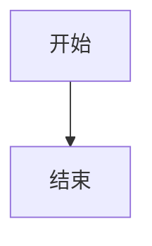

# 配置说明

本文档汇总 `blog/config/*.toml` 的用途、常见字段与启用方式，作为当前仓库的正式配置参考。

## 通用约定

- 所有站点配置都放在 `blog/config/`。
- 所有内容文件都放在 `blog/content/`。
- 配置文件修改后，开发环境会热更新；生产环境需要重新构建。
- 引用本地资源时，路径相对于 `public/`，不要写 `public/` 前缀。
  例如：`themes/default.css`、`fonts/jetbrains-mono.woff2`、`backgrounds/site.webp`
- 需要外链时，直接填写完整 URL，例如 `https://example.com/avatar.png`。

常用命令：

```bash
pnpm dev
pnpm build
pnpm build:lib
pnpm build:content-index
```

## 内容与菜单关系

### 文章目录

- `blog/content/articles/` 下的 Markdown 会参与：
  - 首页
  - 文章列表
  - 分类
  - 标签
  - 归档
  - 搜索

### 自定义页面来源

- `component = "context"`：读取单个 Markdown 文件，配 `file`
- `component = "list"` / `"card"` / `"grid"` / `"timeline"`：读取某个目录下的 Markdown，配 `folder`
- `component = "friends"`：渲染友链页，读取 `links.toml`
- `component = "guestbook"`：渲染留言板页，读取 `guestbook.toml`
- `component = "sponsor"`：渲染赞助页，读取 `sponsor.toml`

## 文章 Frontmatter

文章 Markdown 常用字段：

```yaml
---
title: 示例文章
date: 2026-05-01
updated: 2026-05-10
description: 一段摘要
category: CSS
tags:
  - Tailwind
  - 前端
cover: images/demo-cover.webp
cover_display_mode: page-background
license:
  name: CC BY-NC-SA 4.0
  url: https://creativecommons.org/licenses/by-nc-sa/4.0/
---
```

当前还支持这些扩展字段：

- `updated` / `updated_at` / `lastmod` / `last_modified`
- `cover` / `image` / `thumbnail`
- `cover_display_mode` / `coverDisplayMode`：单篇文章详情页封面显示方式，可选 `image`、`header-background`、`page-background`
- `license: false`
- `license_url`
- `show_outdated_notice`
- `disable_outdated_notice`
- `outdated_threshold`
- `outdated_threshold_days`

## `site.toml`

站点总配置，控制标题、描述、导航、布局、分页、菜单、路由和页脚。

常用区块：

- 顶层字段
  - `title`
  - `subtitle`
  - `description`
  - `site_url`
- `[seo]`
  - `lang`
  - `locale`
  - `author`
  - `site_start_date`
  - `timezone`
  - `keywords`
  - `theme_color`
  - `favicon`
  - `apple_touch_icon`
  - `mask_icon`
  - `mask_icon_color`
  - `og_image`
  - `twitter_image`
  - `[seo.share_image]`
  - `robots`
- `[header.navbar]`
  - `sticky`
  - `blur`
  - `show_brand`
  - `show_title`
  - `show_description`
  - `show_desktop_menu`
  - `show_mobile_menu`
  - `show_search`
  - `show_theme_toggle`
  - `show_sidebar_toggle`
  - `show_mobile_menu_toggle`
- `[footer]`
  - `text`
  - `note`
  - `snippet_html`
- `[features]`
  - `sidebar_visible`
  - `sidebar_position`
  - `show_sidebar_on_articles`
  - `show_category_count`
  - `show_tag_count`
  - `show_read_time`
  - `show_profile_in_sidebar`
  - `show_outdated_notice`
  - `outdated_threshold_days`
- `[sidebar]`
  - `desktop_components`
  - `article_desktop_components`
  - `mobile_components`
  - `article_mobile_components`
- `[page_layouts]`
  - `allow_switch`
  - `persist`
  - 各页的 `default` / `available` / `columns` / `wide_columns`
- `[routing]`
  - 可自定义内建页面路由
- `[pagination]`
  - `page_size`

### `[seo.share_image]`

控制 `og:image` 和 `twitter:image` 的分享图策略。

字段：

- `enabled`：是否输出分享图 meta
- `prefer_page_image`：是否优先使用文章封面或页面 frontmatter 的 `cover`
- `fallback`：没有页面图和默认图时的回退方式，可选 `site`、`seeded`、`none`
- `default_image`：站点默认分享图，路径相对于 `public/`
- `twitter_image`：Twitter 专用分享图，留空时复用默认分享图
- `twitter_card`：Twitter 卡片类型，可选 `summary_large_image`、`summary`
- `seeded_width`：seeded 回退图宽度
- `seeded_height`：seeded 回退图高度
- `seeded_format`：seeded 回退图格式

优先级：

- 文章或页面 `cover` / `image` / `thumbnail`
- `[seo.share_image].default_image`
- `[seo].og_image`
- `fallback = "seeded"` 时生成 seeded 图

示例：

```toml
[seo.share_image]
enabled = true
prefer_page_image = true
fallback = "seeded"
twitter_card = "summary_large_image"
seeded_width = 1200
seeded_height = 630
seeded_format = "webp"
```

### `[[menus.pages]]`

控制站点页面和页面组件。

内建页面 key：

- `home`
- `articles`
- `categories`
- `tags`
- `archive`
- `search`

字段：

- `key`
- `title`
- `description`
- `component`
- `enabled`
- `visible`
- `path`
- `file`
- `folder`

内建页面规则：

- `enabled = false`：不注册运行时路由，也不生成静态页面
- `visible = false`：保留路由，但默认 `blog-nav` 不显示

常见示例：

```toml
[[menus.pages]]
key = "search"
title = "搜索"
enabled = true
visible = false

[[menus.pages]]
key = "about"
title = "关于"
component = "context"
file = "about.md"

[[menus.pages]]
key = "projects"
title = "项目"
component = "grid"
folder = "projects"
```

友链页示例：

```toml
[[menus.pages]]
key = "friends"
title = "友链"
component = "friends"
```

留言板页示例：

```toml
[[menus.pages]]
key = "guestbook"
title = "留言板"
description = "如果你路过这里，欢迎留下几句话。"
component = "guestbook"
content = """
欢迎留下你的来访足迹，也可以简单介绍你自己。
"""
```

赞助页示例：

```toml
[[menus.pages]]
key = "sponsor"
title = "赞助"
component = "sponsor"
```

### `[[menus.header]]` / `[[menus.mobile_header]]`

控制顶部菜单。

可用渲染器：

- `header-pill`
- `header-stack`

可用数据源：

- `blog-nav`
- `custom`

字段：

- `renderer`：菜单渲染器
- `source`：菜单数据源
- `items`：菜单项列表

菜单项字段：

- `page`：引用 `[[menus.pages]]` 的页面 key
- `label`：菜单文字
- `target`：链接地址，内链或外链均可
- `icon`：菜单项前缀文本
- `description`：下拉子项说明
- `children`：子菜单列表

示例：

```toml
[[menus.header]]
renderer = "header-pill"
source = "blog-nav"

[[menus.header.items]]
key = "content"
label = "内容"
children = ["articles", "categories", "tags", "archive"]

[[menus.header.items]]
page = "about"

[[menus.header.items]]
label = "GitHub"
target = "https://github.com/your-name"
```

### `[[menus.sidebar]]`

控制侧边栏菜单模块。

可用渲染器：

- `sidebar-link`
- `sidebar-article`

可用数据源：

- `categories`
- `tags`
- `latest-articles`
- `friend-links`
- `custom`

## `profile.toml`

控制侧边栏个人信息卡片。

常用字段：

- `display_name`
- `username`
- `tagline`
- `bio`
- `avatar_url`
- `location`
- `website`

显示开关：

```toml
[display]
show_avatar = true
show_name = true
show_username = true
show_tagline = true
show_bio = true
show_location = true
show_website = true
show_social_links = true
```

社交链接：

```toml
[[social_links]]
name = "GitHub"
url = "https://github.com/your-name"
icon = "GH"
show_name = true
enabled = true
weight = 100
```

- `icon`：社交链接图标文本。
- `show_name`：是否显示链接名称。
- `enabled`：是否启用该链接。
- `weight`：排序权重，数字越大越靠前。

## `theme.toml`

控制主题资源。

常用字段：

- `current_preset`
- `css_file`
- `js_file`
- `[presets.xxx]`

示例：

```toml
current_preset = "ocean"

[presets.ocean]
css_file = "themes/ocean.css"
js_file = "themes/ocean.js"
```

## `links.toml`

控制友情链接数据。可用于：

- 侧边栏 `source = "friend-links"`
- 独立友链页 `component = "friends"`

独立友链页配置：

```toml
[page]
columns = 2
wide_columns = 3
footer_title = "交换友链说明"
footer_content = """
如果你希望交换友链，可以通过侧边栏的联系方式提交站点信息。
"""
```

- `columns`：常规桌面列数，范围 1-4。
- `wide_columns`：宽屏列数，范围 1-5。
- `footer_title`：页面底部内容标题。
- `footer_content`：页面底部纯文本内容，空行会分段。
- `footer_html`：页面底部可信 HTML 片段。

单条友链支持：

- `name`
- `url`
- `description`
- `avatar_url`
- `tags`
- `location`
- `note`
- `weight`
- `enabled`

## `announcement.toml`

控制全站公告条。

常用字段：

- `enabled`
- `id`
- `title`
- `content`
- `link_text`
- `link_url`
- `dismissible`
- `variant`

`variant` 可选值：

- `info`
- `success`
- `warning`

## `comment.toml`

控制评论系统。

当前支持：

- `giscus`
- `utterances`

顶层字段：

- `enabled`
- `provider`
- `title`
- `description`
- `not_ready_text`

### `giscus`

常用字段：

- `repo`
- `repo_id`
- `category`
- `category_id`
- `mapping`
- `term`
- `strict`
- `reactions_enabled`
- `emit_metadata`
- `input_position`
- `lang`
- `loading`
- `theme`
- `dark_theme`

### `utterances`

常用字段：

- `repo`
- `issue_term`
- `issue_number`
- `label`
- `theme`
- `dark_theme`
- `crossorigin`

## `sponsor.toml`

控制文章详情页底部赞助区和独立赞助页。

常用字段：

- `enabled`
- `show_on_articles`
- `page_enabled`
- `title`
- `description`
- `button_text`
- `button_url`
- `button_note`
- `page_kicker`
- `page_title`
- `page_description`
- `supporters_title`
- `supporters_description`

二维码 / 多赞助方式：

```toml
[[methods]]
name = "微信赞赏"
account_name = "微信扫码"
image_url = "images/sponsor/wechat-pay.png"
note = "适合国内读者"
weight = 100
```

赞助者列表：

```toml
[[supporters]]
name = "示例赞助者"
tier = "支持者"
amount = "¥50"
date = "2026-05"
description = "感谢支持内容更新。"
avatar_url = "images/sponsor/supporter.png"
url = "https://example.com"
weight = 100
```

独立页需要在 `site.toml` 的 `[[menus.pages]]` 中配置：

```toml
[[menus.pages]]
key = "sponsor"
title = "赞助"
component = "sponsor"
```

## `license.toml`

控制文章默认许可协议。

常用字段：

- `enabled`
- `name`
- `url`

单篇文章可用 frontmatter 覆盖；如果不想继承默认协议，可写：

```yaml
license: false
```

## `analytics.toml`

控制统计脚本。

全局字段：

- `enabled`
- `respect_dnt`
- `track_localhost`

当前支持：

- `[umami]`
- `[plausible]`
- `[google_analytics]`
- `[clarity]`

### Umami

- `enabled`
- `script_url`
- `website_id`
- `host_url`
- `domains`

### Plausible

- `enabled`
- `script_url`
- `domain`
- `endpoint`

### Google Analytics 4

- `enabled`
- `measurement_id`
- `manual_pageviews`
- `debug_mode`

### Microsoft Clarity

- `enabled`
- `project_id`

## `font.toml`

控制字体栈、字体预设和本地 `@font-face`。

常用字段：

- `enabled`
- `preset` / `current_preset`
- `preload`
- `base_size`
- `[families]`
- `[dark_families]`
- `[presets.xxx]`
- `[[faces]]`

字段说明：

- `enabled`：是否启用字体配置。关闭时不输出字体 CSS 和 preload。
- `preset` / `current_preset`：当前字体预设名。内置值为 `system`、`sans`、`serif`、`mono`。
- `preload`：字体预加载策略。`marked` 只预加载 `preload = true` 的字体，`all` 预加载全部字体，`none` 不预加载。
- `base_size`：根字号。纯数字按 `px` 处理，也可以写完整 CSS 尺寸值。
- `[families]`：亮色模式字体栈。支持 `sans`、`heading`、`serif`、`mono`。
- `[dark_families]`：暗色模式字体栈覆盖，只填写需要和亮色不同的字段。
- `[presets.xxx]`：自定义字体预设。可配置 `base_size`、`preload`、`[presets.xxx.families]`、`[presets.xxx.dark_families]` 和 `[[presets.xxx.faces]]`。
- `[[faces]]`：自托管字体文件。`family` 是字体名，`src` 是 `public/` 下路径，`weight` 是字重，`style` 是样式，`display` 是显示策略，`preload` 控制当前字体是否预加载。

示例：

```toml
enabled = true
preset = "sans"
preload = "marked"
base_size = "16px"

[families]
sans = "\"PingFang SC\", \"Microsoft YaHei\", sans-serif"
mono = "\"JetBrains Mono\", monospace"

[dark_families]
heading = "\"PingFang SC\", \"Microsoft YaHei\", sans-serif"

[presets.reading]
base_size = "17px"

[presets.reading.families]
heading = "\"Noto Serif CJK SC\", \"Source Han Serif SC\", Georgia, serif"

[[faces]]
family = "JetBrains Mono"
src = "fonts/jetbrains-mono-regular.woff2"
weight = "400"
style = "normal"
display = "swap"
preload = true
```

## `code_block.toml`

控制 Markdown 代码块增强行为。

常用字段：

- `enabled`
- `show_language`
- `show_filename`
- `show_copy_button`
- `show_line_numbers`
- `line_number_start`
- `theme`
- `dark_theme`
- `copy_label`
- `copied_label`
- `wrap_long_lines`
- `max_height`
- `collapsible`
- `collapse_threshold_lines`
- `preview_lines`
- `expand_label`
- `collapse_label`
- `mark_diff_lines`
- `[languages.xxx]`

`theme` / `dark_theme` 可选值：

- `default`
- `github`
- `dracula`

文件名写在代码围栏信息里：

````md
```ts filename=src/app.ts
console.log('hello')
```
````

按语言覆盖配置写在 `[languages.语言名]` 下，未填写的字段会继承全局配置。常见别名会自动映射，例如 `js` 映射到 `javascript`，`ts` 映射到 `typescript`，`bash` 映射到 `shell`。

```toml
[languages.javascript]
collapse_threshold_lines = 28
preview_lines = 22

[languages.bash]
show_line_numbers = false
wrap_long_lines = true

[languages.diff]
show_copy_button = false
show_line_numbers = false
mark_diff_lines = true
```

## `markdown.toml`

控制 Markdown 内容增强能力。

常用字段：

- `enabled`：是否启用 Markdown 增强
- `[callouts]`：提示块配置
- `[mermaid]`：Mermaid 图表配置
- `[math]`：公式配置

`[callouts]` 字段：

- `enabled`：是否启用提示块
- `syntax`：提示块语法，目前支持 `github`
- `default_type`：未知类型的回退类型
- `show_icon`：是否显示类型标记
- `[callouts.labels]`：类型标题文案
- `[callouts.icons]`：类型标记文案
- `[callouts.aliases]`：类型别名映射

支持写法：

```md
> [!NOTE]
> 这里是提示内容。

> [!WARNING] 自定义标题
> 这里是警告内容。
```

默认类型：

- `note`
- `tip`
- `important`
- `warning`
- `caution`
- `info`
- `success`
- `danger`

`[mermaid]` 字段：

- `enabled`：是否启用 Mermaid 语法
- `render`：是否在浏览器端渲染为 SVG
- `script_url`：Mermaid 浏览器脚本地址
- `theme`：亮色主题
- `dark_theme`：暗色主题
- `security_level`：Mermaid 安全级别

Mermaid 写法：

````md

````

`[math]` 字段：

- `enabled`：是否启用公式语法
- `render`：是否在浏览器端渲染公式
- `engine`：公式渲染引擎，目前支持 `katex`
- `script_url`：KaTeX 浏览器脚本地址
- `css_url`：KaTeX 样式地址
- `inline_dollar`：是否启用 `$x$`
- `inline_parentheses`：是否启用 `\(x\)`
- `block_dollar`：是否启用 `$$...$$`
- `block_brackets`：是否启用 `\[...\]`
- `throw_on_error`：公式错误时是否抛出异常
- `error_color`：公式错误颜色
- `strict`：KaTeX strict 选项

公式写法：

```md
行内公式：$E = mc^2$

$$
\int_0^1 x^2 dx = \frac{1}{3}
$$
```

## `background.toml`

控制站点背景层。

常用字段：

- `enabled`
- `mode`
- `gradient_light`
- `gradient_dark`
- `image`
- `dark_image`
- `overlay_light`
- `overlay_dark`
- `position`
- `size`
- `repeat`
- `attachment`
- `opacity`

`mode` 可选值：

- `none`
- `gradient`
- `image`

## `cover.toml`

控制文章封面回退策略、列表封面和详情页封面行为。

顶层字段：

- `enabled`
- `fallback`
- `fallback_image`
- `seeded_width`
- `seeded_height`
- `seeded_format`
- `seeded_style`：自动封面默认图源，可选 `picsum`、`cataas`、`mwm-anime`、`mwm-scenery`、`xjh-acg`、`bing-rand`

内置图源：

- `picsum`：Picsum 随机照片
- `cataas`：Cataas 猫图
- `mwm-anime`：MWM 二次元随机图
- `mwm-scenery`：MWM 风景随机图
- `xjh-acg`：XJH ACG 随机图
- `bing-rand`：Bing 随机图

`[source_switch]` 常用字段：

- `enabled`：是否在页头显示封面图源切换按钮
- `storage_key`：浏览器本地存储 key
- `sources`：按钮循环切换的图源列表

`[source_switch.labels]` 常用字段：

- 每个 key 对应按钮显示文案

`fallback` 可选值：

- `none`
- `seeded`
- `image`

`[detail]` 常用字段：

- `show_cover`
- `show_related_cover`
- `display_mode`
- `loading`
- `aspect_ratio`
- `object_fit`
- `placeholder`

`[list]` 常用字段：

- `show_cover`
- `loading`
- `aspect_ratio`
- `object_fit`
- `placeholder`

`[detail.watermark]` 常用字段：

- `enabled`
- `text`
- `position`
- `opacity`

示例：

```toml
enabled = true
fallback = "seeded"
seeded_style = "picsum"

[source_switch]
enabled = true
storage_key = "vue-blog-cover-source"
sources = ["picsum", "cataas", "mwm-anime", "mwm-scenery", "xjh-acg", "bing-rand"]

[source_switch.labels]
picsum = "Picsum"
cataas = "Cataas"
mwm-anime = "MWM 二次元"
mwm-scenery = "MWM 风景"
xjh-acg = "XJH ACG"
bing-rand = "Bing 随机"

[list]
show_cover = true
loading = "lazy"
aspect_ratio = "16 / 9"
object_fit = "cover"
placeholder = "gradient"

[detail]
show_cover = true
show_related_cover = true
display_mode = "image"
loading = "eager"
object_fit = "cover"

[detail.watermark]
enabled = false
text = "Filling"
position = "bottom-right"
opacity = 0.72
```

## `guestbook.toml`

控制留言板页的说明区。留言内容默认复用 `comment.toml`，也可以在 `[comment]` 中单独覆盖。

常用字段：

- `enabled`
- `kicker`
- `title`
- `description`
- `guidelines`
- `template`
- `contact_label`
- `contact_url`
- `comment_title`
- `comment_description`
- `comment_not_ready_text`
- `[comment]`
- `[comment.giscus]`
- `[comment.utterances]`

`[comment]` 字段：

- `enabled`：是否显示留言区
- `provider`：留言区评论提供商；不填时继承 `comment.toml`
- `title`：留言区标题
- `description`：留言区说明
- `not_ready_text`：留言区未就绪提示

`[comment.giscus]` / `[comment.utterances]` 字段和 `comment.toml` 中对应 provider 一致。只填写需要覆盖的字段，其余会继承全站评论配置。

常见做法是让留言板使用独立 Giscus 话题：

```toml
[comment]
enabled = true
title = "开始留言"
description = "这里的评论会单独归到留言板。"
provider = "giscus"

[comment.giscus]
mapping = "specific"
term = "guestbook"
```

启用留言板需要两步：

1. 在 `guestbook.toml` 中设置 `enabled = true`
2. 在 `site.toml` 中新增一个 `component = "guestbook"` 的页面

## 推荐启用顺序

如果你是第一次搭站，建议按这个顺序开配置：

1. `site.toml`
2. `profile.toml`
3. `theme.toml`
4. `comment.toml`
5. `license.toml`
6. `cover.toml`
7. `analytics.toml`
8. `background.toml`
9. `font.toml`
10. `markdown.toml`
11. `guestbook.toml`
